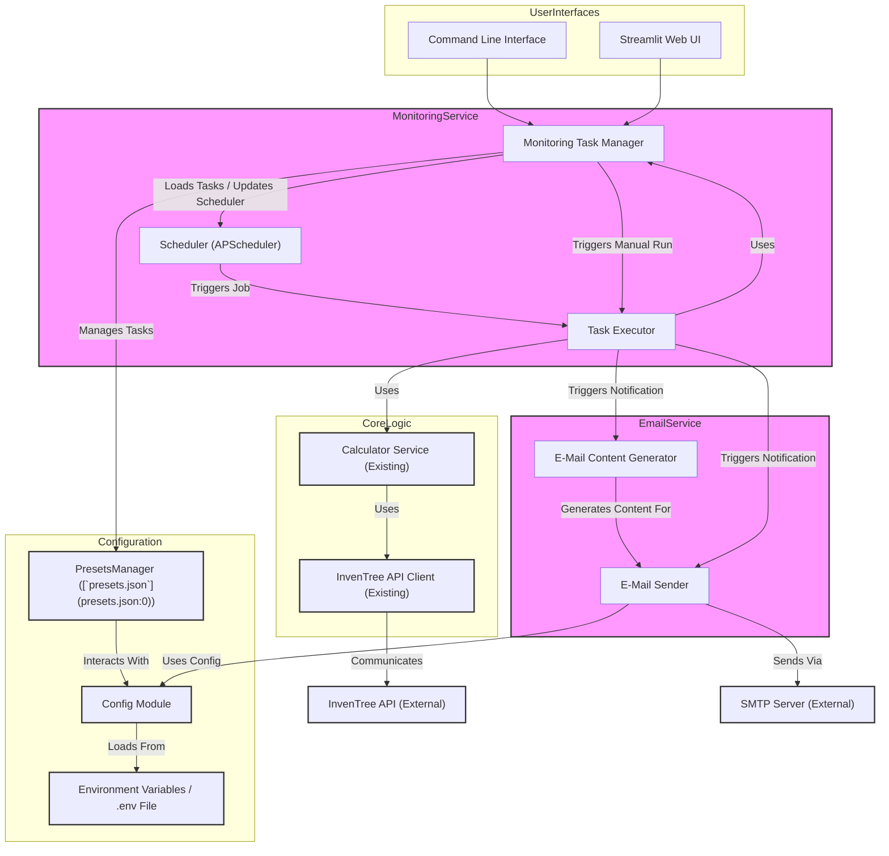
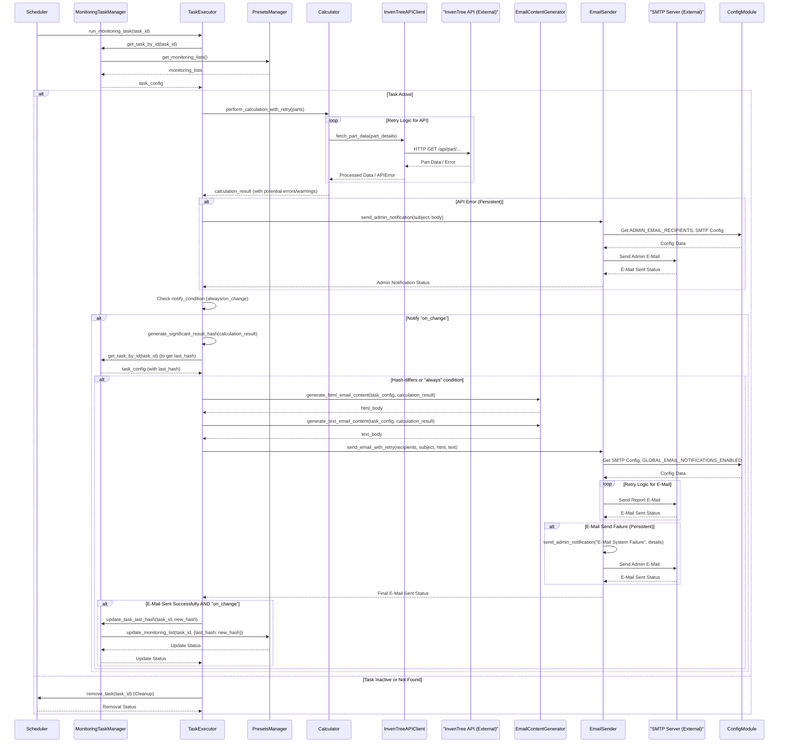

# System Architecture: Automated Parts List Monitoring and E-Mail Notification

## 1. Overview

This document outlines the system architecture for the "Automated Parts List Monitoring and E-Mail Notification" feature. This feature allows users to define parts lists that are automatically checked against InvenTree stock levels at configured intervals, with notifications sent via e-mail based on the results.

The architecture integrates new services for monitoring and e-mail dispatch with existing application components like the calculator, API client, and configuration management.

## 2. Architectural Goals

*   **Modularity:** Clearly defined components with distinct responsibilities.
*   **Scalability:** Ability to handle a reasonable number of concurrent monitoring tasks.
*   **Maintainability:** Well-structured code, clear interfaces, and good documentation.
*   **Reliability:** Robust error handling, retries, and admin notifications for critical failures.
*   **Security:** Secure handling of sensitive data, especially e-mail credentials.

## 3. System Components

The system is composed of the following main components:

1.  **Monitoring Service:** The core of the new feature, responsible for scheduling and executing monitoring tasks.
    *   **Scheduler:** Manages job execution based on cron schedules. (Technology: APScheduler)
    *   **Task Executor:** Performs the logic for a single monitoring run (data fetching, calculation, triggering notification).
    *   **Monitoring Task Manager:** Handles CRUD operations for monitoring tasks, interfacing with the `PresetsManager`.
2.  **E-Mail Service:** Responsible for generating and sending e-mail notifications.
    *   **E-Mail Content Generator:** Creates HTML and plain-text e-mail bodies from calculation results.
    *   **E-Mail Sender:** Connects to an SMTP server and dispatches e-mails, including retry logic.
3.  **Calculator Service (Existing):** Reused to perform the parts list availability and cost calculation against InvenTree data.
4.  **InvenTree API Client (Existing):** Facilitates communication with the InvenTree API to fetch parts data.
5.  **Configuration Management (Existing & Extended):**
    *   **`PresetsManager`:** Stores and manages monitoring list configurations in [`presets.json`](presets.json:0).
    *   **`Config` Module:** Loads and provides access to application-wide configuration, including e-mail server settings from environment variables or an `.env` file.
6.  **User Interfaces (Existing & Extended):**
    *   **Command Line Interface (CLI):** Provides commands for managing monitoring tasks (CRUD, activate/deactivate, manual run).
    *   **Streamlit Web UI:** Offers a graphical interface for managing monitoring tasks.

## 4. System Diagrams

### 4.1. Component Diagram



### 4.2. Sequence Diagram: Scheduled Monitoring Task Execution



## 5. Service Boundaries and Responsibilities

### 5.1. Monitoring Service
*   **Responsibilities:**
    *   Manages the lifecycle of monitoring tasks (scheduling, adding, removing, updating based on `MonitoringTaskManager` actions).
    *   Executes individual monitoring tasks at scheduled times or manually.
    *   Orchestrates the process of fetching task configuration, running calculations, determining if notification is needed, and triggering e-mail generation and sending.
    *   Handles retries for InvenTree API communication during calculations.
    *   Updates the `last_hash` for tasks with `on_change` notification condition.
*   **Boundaries:**
    *   Interacts with `MonitoringTaskManager` for task definitions.
    *   Uses the `Calculator` service for parts list evaluation.
    *   Delegates e-mail generation and sending to the `EmailService`.
    *   Does not directly manage [`presets.json`](presets.json:0) or SMTP credentials.

### 5.2. E-Mail Service
*   **Responsibilities:**
    *   Generates HTML and plain-text e-mail content based on calculation results and task configuration.
    *   Connects to the configured SMTP server.
    *   Sends e-mails to specified recipients.
    *   Implements retry logic for e-mail sending.
    *   Sends administrative notifications for critical system errors (e.g., persistent e-mail failure, API unavailability).
*   **Boundaries:**
    *   Receives calculation results and task details from the `MonitoringService` (via `TaskExecutor`).
    *   Retrieves SMTP configuration and admin e-mail recipients from the `Config` module.
    *   Interacts with an external SMTP server.
    *   Does not know about scheduling or the specifics of parts calculation.

### 5.3. Calculator Service (Existing)
*   **Responsibilities:**
    *   Takes a list of parts and quantities.
    *   Uses the `InvenTreeAPIClient` to fetch current stock levels and part details from InvenTree.
    *   Calculates availability, shortages, and potentially costs.
    *   Returns a structured result including any errors encountered during its process (e.g., part not found).
*   **Boundaries:**
    *   Invoked by the `MonitoringService` (`TaskExecutor`).
    *   Relies on `InvenTreeAPIClient` for external data.

### 5.4. InvenTree API Client (Existing)
*   **Responsibilities:**
    *   Handles all HTTP communication with the InvenTree API.
    *   Manages authentication with InvenTree.
    *   Parses API responses and returns data in a usable format.
*   **Boundaries:**
    *   Used by the `CalculatorService`.
    *   Interacts with the external InvenTree API.

### 5.5. Configuration Management
*   **`PresetsManager`:**
    *   **Responsibilities:** CRUD operations for `monitoring_lists` within [`presets.json`](presets.json:0). Validates schema of monitoring list entries.
    *   **Boundaries:** Used by `MonitoringTaskManager`, CLI, and Streamlit UI.
*   **`Config` Module:**
    *   **Responsibilities:** Loads and provides access to global configurations, especially e-mail server settings (`EMAIL_SMTP_SERVER`, `EMAIL_PASSWORD`, etc.) and admin e-mail lists from environment variables or `.env` file. Manages `GLOBAL_EMAIL_NOTIFICATIONS_ENABLED` flag.
    *   **Boundaries:** Used by `EmailService` and potentially other parts of the application for global settings.
*   **Environment Variables / `.env` File:**
    *   **Responsibilities:** Securely stores sensitive configuration like SMTP credentials.
    *   **Boundaries:** Read by the `Config` module at startup. Not directly accessed by other services.

### 5.6. User Interfaces (CLI & Streamlit UI)
*   **Responsibilities:**
    *   Allow users to list, add, update, delete, activate, and deactivate monitoring tasks.
    *   Allow users to manually trigger a monitoring task.
    *   Present task status and information clearly.
*   **Boundaries:**
    *   Interact with the `MonitoringTaskManager` to perform actions on monitoring tasks.
    *   Do not directly interact with the `Scheduler` or `TaskExecutor` for task management (this is mediated by `MonitoringTaskManager`).

## 6. Interfaces

### 6.1. MonitoringTaskManager
*   `get_all_monitoring_tasks() -> List[MonitoringTask]`
*   `get_all_active_monitoring_tasks() -> List[MonitoringTask]`
*   `get_task_by_id(task_id: str) -> Optional[MonitoringTask]`
*   `add_task(task_data: Dict) -> bool` (task_data includes name, parts, schedule, recipients, notify_condition)
*   `update_task(task_id: str, updated_data: Dict) -> bool`
*   `delete_task(task_id: str) -> bool`
*   `activate_task(task_id: str) -> bool`
*   `deactivate_task(task_id: str) -> bool`
*   `update_task_last_hash(task_id: str, new_hash: str) -> bool`
*   `run_task_manually(task_id: str) -> None` (triggers `TaskExecutor.run_monitoring_task`)

### 6.2. Scheduler (Internal to MonitoringService, managed via MonitoringTaskManager actions)
*   `schedule_task(task_config: MonitoringTask)`
*   `remove_task(task_id: str)`
*   `initialize_scheduler()`
*   `shutdown_scheduler()`

### 6.3. TaskExecutor (Internal to MonitoringService)
*   `run_monitoring_task(task_id: str) -> None`
    *   Input: `task_id`
    *   Output: None (effects: calculation performed, e-mail potentially sent, task hash updated)
*   `perform_calculation_with_retry(parts_list: List[Dict]) -> CalculationResult`
*   `generate_significant_result_hash(calculation_result: CalculationResult) -> str`

### 6.4. EmailService
*   `generate_html_email_content(task_config: MonitoringTask, calculation_result: CalculationResult) -> str`
*   `generate_text_email_content(task_config: MonitoringTask, calculation_result: CalculationResult) -> str`
*   `send_email_with_retry(recipients: List[str], subject: str, html_body: str, text_body: str) -> bool`
*   `send_admin_notification(subject: str, text_body_content: str) -> bool`

### 6.5. CalculatorService (Existing Interface - conceptual)
*   `calculate_bom_cost_and_availability(parts_list: List[Dict]) -> CalculationResult`
    *   `CalculationResult` (Data Structure):
        *   `summary: Dict` (total_parts_requested, total_parts_available, etc.)
        *   `detailed_bom: List[Dict]` (part_name, version, required, available, missing, notes)
        *   `has_alternatives_info: bool`
        *   `alternatives_info: List[Dict]` (if applicable)
        *   `warnings_or_errors: List[str]` (e.g., "Part X not found in InvenTree")
        *   `has_critical_error: bool` (e.g., API unreachable after retries)
        *   `error_message: Optional[str]`
        *   `is_api_error: bool`
        *   `is_retryable: bool` (for API errors)
        *   Methods like `get_missing_parts_summary()`, `get_critical_threshold_parts_summary()` for hash generation.

### 6.6. Data Formats
*   **Monitoring Task in [`presets.json`](presets.json:0):**
    ```json
    {
      "id": "uuid_string",
      "name": "User-defined Name",
      "parts": [{"name": "PartA", "quantity": 10, "version": "optional_version"}],
      "active": true,
      "cron_schedule": "0 * * * *",
      "recipients": ["user1@example.com"],
      "notify_condition": "on_change" | "always",
      "last_hash": "md5_hash_string"
    }
    ```
*   **E-Mail Configuration (Environment Variables):**
    *   `EMAIL_SMTP_SERVER`, `EMAIL_SMTP_PORT`, `EMAIL_USE_TLS`, `EMAIL_USE_SSL`, `EMAIL_USERNAME`, `EMAIL_PASSWORD`, `EMAIL_SENDER_ADDRESS`, `ADMIN_EMAIL_RECIPIENTS`, `GLOBAL_EMAIL_NOTIFICATIONS_ENABLED`.

## 7. Data Flow

1.  **Task Configuration:**
    *   User (via CLI/UI) -> `MonitoringTaskManager` -> `PresetsManager` -> [`presets.json`](presets.json:0).
    *   `MonitoringTaskManager` informs `Scheduler` to add/update/remove jobs.
2.  **Scheduled Task Execution:**
    *   `Scheduler` triggers `TaskExecutor.run_monitoring_task(task_id)`.
    *   `TaskExecutor` retrieves `task_config` from `MonitoringTaskManager`.
    *   `TaskExecutor` calls `Calculator.calculate_bom_cost_and_availability(task_config.parts)`.
        *   `Calculator` uses `InvenTreeAPIClient` to fetch data from the external InvenTree API.
    *   `Calculator` returns `calculation_result` to `TaskExecutor`.
3.  **Notification Decision:**
    *   If `calculation_result` has a critical error (e.g., API unreachable), `TaskExecutor` triggers `EmailService.send_admin_notification`.
    *   `TaskExecutor` checks `GLOBAL_EMAIL_NOTIFICATIONS_ENABLED`. If false, stops.
    *   `TaskExecutor` checks `task_config.notify_condition`:
        *   If `"always"`: Proceed to send e-mail.
        *   If `"on_change"`:
            *   `TaskExecutor` generates `current_result_hash` from `calculation_result`.
            *   Compares `current_result_hash` with `task_config.last_hash`.
            *   If different, proceed to send e-mail.
4.  **E-Mail Generation and Sending:**
    *   `TaskExecutor` calls `EmailService.generate_html_email_content` and `generate_text_email_content`.
    *   `TaskExecutor` calls `EmailService.send_email_with_retry` with generated content and `task_config.recipients`.
        *   `EmailService` retrieves SMTP settings from `ConfigModule`.
        *   `EmailService` attempts to send e-mail via external SMTP server, retrying on failure.
        *   If persistent failure, `EmailService` sends an admin notification about the e-mail system failure.
5.  **State Update (for "on_change"):**
    *   If e-mail sent successfully and `notify_condition` was `"on_change"`, `TaskExecutor` calls `MonitoringTaskManager.update_task_last_hash(task_id, current_result_hash)`.
    *   `MonitoringTaskManager` updates [`presets.json`](presets.json:0) via `PresetsManager`.

## 8. Scalability and Maintainability

### 8.1. Scalability
*   **Scheduler:** `APScheduler` is capable of handling many jobs. The primary concern would be the resource consumption of concurrently executing tasks.
*   **Task Execution:** Each task involves API calls and computation.
    *   If many tasks run simultaneously, they could strain the InvenTree API or local resources.
    *   `APScheduler` can be configured with thread/process pools to limit concurrency if needed.
    *   The current design assumes a moderate number of tasks. For very high scalability (hundreds/thousands of frequently running tasks), a distributed task queue system (e.g., Celery, RQ) might be considered, but this is likely overkill for the current scope.
*   **E-Mail Sending:** SMTP server limits and network latency are factors. Retry logic helps. Bulk sending is not a primary use case.
*   **[`presets.json`](presets.json:0):** For a very large number of tasks, JSON file parsing/writing could become a minor bottleneck. A database could be an alternative for extreme scale, but [`presets.json`](presets.json:0) is suitable for the expected load.

### 8.2. Maintainability
*   **Modularity:** The separation into `MonitoringService`, `EmailService`, `Calculator`, etc., with clear responsibilities and interfaces, promotes maintainability. Changes within one service are less likely to impact others.
*   **Configuration:** Centralized configuration for e-mail settings and task definitions simplifies management.
*   **Logging:** Comprehensive logging (as specified in pseudocode) is crucial for debugging and monitoring system health.
*   **Testing:** The TDD anchors in the specifications and pseudocode provide a good foundation for unit and integration tests, which are essential for maintainability.
*   **Code Clarity:** Adherence to coding standards and clear naming conventions will be important.

## 9. Security Aspects

*   **E-Mail Credentials (`EMAIL_PASSWORD`):**
    *   **MUST** be loaded from environment variables or an `.env` file (which is in `.gitignore`).
    *   **NEVER** hardcode in source code or commit to version control.
    *   The `Config` module is responsible for securely loading these.
*   **InvenTree API Token (if applicable, part of existing API Client):**
    *   Should follow similar secure storage practices (environment variables).
*   **Access Control for Task Management:**
    *   The CLI and Streamlit UI are the entry points for managing tasks. If the application is deployed in a shared environment, appropriate authentication/authorization for these interfaces might be needed (currently out of scope of this specific feature's architecture but a general consideration).
*   **Data in E-Mails:**
    *   E-mails will contain parts list data. Ensure recipients are correctly configured and authorized to see this information.
*   **Input Validation:**
    *   Cron expressions, e-mail addresses, and part names/quantities from user input (CLI/UI) should be validated by the `MonitoringTaskManager` or `PresetsManager` before being stored or used to prevent errors or potential injection issues (though the risk is low with current data types).
*   **Error Messages:**
    *   Avoid leaking sensitive system details in error messages sent to regular users. Admin notifications can be more detailed.

## 10. Technology Stack (Confirmation & Recommendations)

*   **Scheduling:** `APScheduler` (Python library) - Confirmed as per specification. It's robust, flexible, and well-suited for in-process scheduling.
*   **E-Mail Sending:** Standard Python libraries like `smtplib` (for SMTP communication) and `email.mime` (for message construction) are appropriate. No specific third-party library is strictly necessary unless advanced features (e.g., complex templating beyond basic string formatting) are desired for e-mails, which is not currently the case.
*   **Cron Parsing:** `APScheduler` handles cron string parsing internally.
*   **Hashing:** Standard Python `hashlib` (e.g., for MD5) for `last_hash` generation.
*   **UUID Generation:** Standard Python `uuid` module for task IDs.
*   **Configuration:** Environment variables and `.env` files (e.g., using `python-dotenv` library) for sensitive data. [`presets.json`](presets.json:0) for task definitions.

## 11. Deployment Considerations (Brief)

*   The monitoring service is designed to run as a persistent background process.
*   If deployed using Docker, the main application entry point would need to initialize and start the `Scheduler`.
*   Ensure environment variables for e-mail configuration are correctly set in the deployment environment.
*   Logging should be configured to output to a persistent location or a log management system.

## 12. Future Considerations / Potential Enhancements

*   **Webhooks:** Instead of or in addition to e-mail, send notifications via webhooks to other systems.
*   **More Sophisticated "Change" Detection:** Allow users to define more granular conditions for what constitutes a "significant change."
*   **UI for Log Viewing:** A section in the Streamlit UI to view recent monitoring activity and logs.
*   **Distributed Scheduler/Executor:** For very high-scale deployments, moving to a system like Celery.
*   **Advanced E-Mail Templating:** If e-mail designs become more complex.

This architecture provides a solid foundation for implementing the automated monitoring and notification feature, balancing current requirements with considerations for future growth and maintenance.