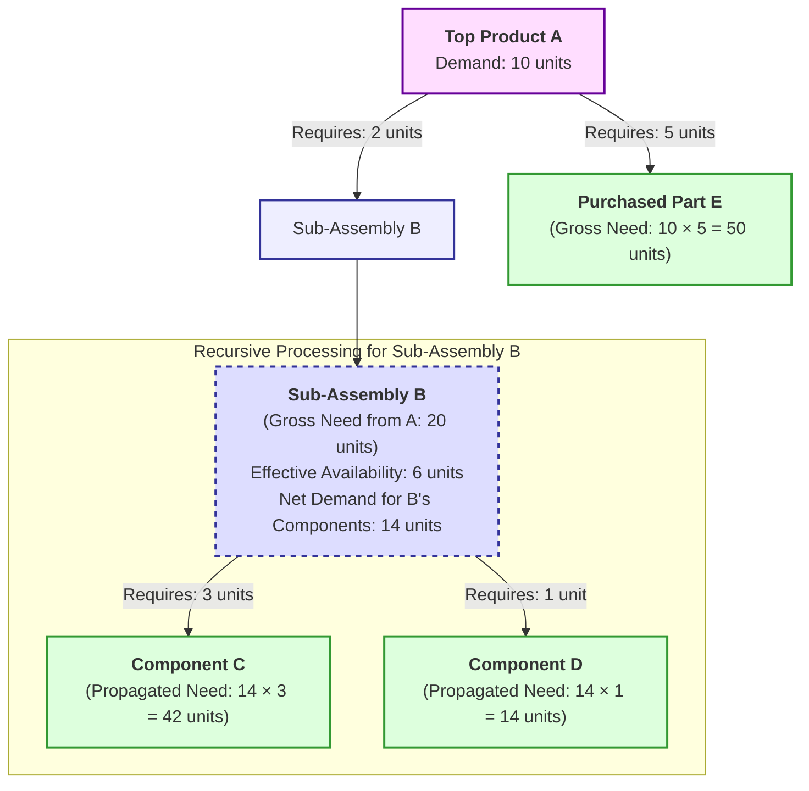

# Inventree Order Calculator: Calculation Explanation

This document details how the Inventree Order Calculator processes input parts and their Bills of Materials (BOMs) to determine required quantities for purchasing and manufacturing. The primary logic resides in [`src/inventree_order_calculator/calculator.py`](../src/inventree_order_calculator/calculator.py:1), with UI display formatting in [`src/inventree_order_calculator/streamlit_app.py`](../src/inventree_order_calculator/streamlit_app.py:1).

After a calculation, the Streamlit UI typically displays two main tables derived from the [`OutputTables`](../src/inventree_order_calculator/models.py:7) object:

1.  **Parts to Order Table**: Lists raw materials and components that need to be purchased.
2.  **Subassemblies to Build Table**: Lists subassemblies that need to be manufactured.

The data for these tables comes from a collection of [`CalculatedPart`](../src/inventree_order_calculator/models.py:7) objects, which are populated during the calculation process.

## Core Calculation Steps Overview

The calculation is initiated by the [`OrderCalculator.calculate_orders()`](../src/inventree_order_calculator/calculator.py:199) method:

1.  **Initialization**: The internal cache (`calculated_parts_dict`) storing [`CalculatedPart`](../src/inventree_order_calculator/models.py:7) objects is cleared.
2.  **Recursive BOM Explosion**: For each top-level part provided by the user:
    *   The [`_calculate_required_recursive()`](../src/inventree_order_calculator/calculator.py:69) method is called. This method traverses the BOM, calculating the `total_required` quantity for each component and subassembly. It handles nested assemblies and applies a netting logic (see "Recursive BOM Calculation Details" below).
3.  **Final Calculations**: After the recursion completes for all input parts:
    *   The system iterates through all unique parts found (stored in `calculated_parts_dict`).
    *   For each part, it calculates:
        *   `available` quantity: Using [`_calculate_availability()`](../src/inventree_order_calculator/calculator.py:33).
        *   `to_order` quantity (for purchaseable parts).
        *   `to_build` quantity (for assemblies).
4.  **Output Generation**: The [`CalculatedPart`](../src/inventree_order_calculator/models.py:7) objects are then filtered and formatted into the two main tables for display.

## 1. Parts to Order Table

This table lists components that need to be purchased. It's generated by the [`format_parts_to_order_for_display()`](../src/inventree_order_calculator/streamlit_app.py:256) function from [`CalculatedPart`](../src/inventree_order_calculator/models.py:7) objects where the calculated `to_order` quantity is greater than zero.

| Column Header               | Source Data (`CalculatedPart` attribute)                                     | Calculation/Description                                                                                                                               |
| :-------------------------- | :--------------------------------------------------------------------------- | :---------------------------------------------------------------------------------------------------------------------------------------------------- |
| **Part ID**                 | `pk`                                                                         | The unique primary key of the part from InvenTree.                                                                                                    |
| **Part Name (linked)**      | `name` (used in URL)                                                         | The name of the part. Displayed as a hyperlink to the part's page in InvenTree, constructed using `AppConfig.inventree_instance_url`, `pk`, and `name`. |
| **Needed**                  | `total_required`                                                             | The gross total quantity of this part required across all top-level inputs, calculated recursively.                                                   |
| **Total In Stock**          | `total_in_stock`                                                             | Current stock quantity of this part in InvenTree. (From `PartData.total_in_stock`)                                                                    |
| **Required for Build Orders** | `required_for_build_orders`                                                  | Quantity of this part already committed to existing build orders in InvenTree. (From `PartData.required_for_build_orders`)                             |
| **Required for Sales Orders** | `required_for_sales_orders`                                                  | Quantity of this part already committed to existing sales orders in InvenTree. (From `PartData.required_for_sales_orders`)                             |
| **Available**               | `available`                                                                  | Calculated by [`_calculate_availability()`](../src/inventree_order_calculator/calculator.py:33): `total_in_stock - (required_for_build_orders + required_for_sales_orders)`. |
| **To Order**                | `to_order`                                                                   | Calculated as `max(0.0, total_required - available)`. This is the net quantity to purchase.                                                           |
| **On Order**                | `ordering`                                                                   | Quantity of this part already on order from suppliers (WIP for purchasing). (From `PartData.ordering`)                                                |
| **Belongs to**              | `belongs_to_top_parts`                                                       | A comma-separated list of top-level part names for which this part is a required component.                                                           |

## 2. Subassemblies to Build Table

This table lists subassemblies that need to be manufactured. It's generated by the [`format_assemblies_to_build_for_display()`](../src/inventree_order_calculator/streamlit_app.py:309) function from [`CalculatedPart`](../src/inventree_order_calculator/models.py:7) objects that are assemblies and have either `building > 0` (already in production) or `to_build > 0` (newly required to be built).

| Column Header               | Source Data (`CalculatedPart` attribute)                                     | Calculation/Description                                                                                                                               |
| :-------------------------- | :--------------------------------------------------------------------------- | :---------------------------------------------------------------------------------------------------------------------------------------------------- |
| **Part ID**                 | `pk`                                                                         | The unique primary key of the assembly from InvenTree.                                                                                                |
| **Part Name (linked)**      | `name` (used in URL)                                                         | The name of the assembly. Displayed as a hyperlink.                                                                                                   |
| **Needed**                  | `total_required`                                                             | The gross total quantity of this assembly required across all top-level inputs, calculated recursively.                                               |
| **Total In Stock**          | `total_in_stock`                                                             | Current stock quantity of this assembly in InvenTree.                                                                                                 |
| **Required for Build Orders** | `required_for_build_orders`                                                  | Quantity of this assembly already committed to existing build orders.                                                                                 |
| **Required for Sales Orders** | `required_for_sales_orders`                                                  | Quantity of this assembly already committed to existing sales orders.                                                                                 |
| **Available**               | `available`                                                                  | Calculated by [`_calculate_availability()`](../src/inventree_order_calculator/calculator.py:33): `total_in_stock - (required_for_build_orders + required_for_sales_orders)`. |
| **In Production**           | `building`                                                                   | Quantity of this assembly currently being manufactured (Work In Progress). (From `PartData.building`)                                                 |
| **To Build**                | `to_build`                                                                   | Calculated as `max(0.0, total_required - (available + building))`. This is the net quantity of this assembly to manufacture.                         |
| **Belongs to**              | `belongs_to_top_parts`                                                       | A comma-separated list of top-level part names for which this assembly is required.                                                                   |

## Recursive BOM Calculation Details

The heart of the calculator is the [`_calculate_required_recursive()`](../src/inventree_order_calculator/calculator.py:69) method. It determines the `total_required` quantity for every part by exploding the BOM down to its raw components.

**Key steps for each part processed recursively:**

1.  **Fetch/Create `CalculatedPart`**: If the part hasn't been processed yet, its data is fetched from InvenTree (via `api_client.get_part_data()`) and a new [`CalculatedPart`](../src/inventree_order_calculator/models.py:7) object is created and stored.
2.  **Update Total Required**: The `total_required` for the current part is incremented by `quantity_needed_for_parent` (the amount of this part required by its direct parent in this specific BOM path).
3.  **Track Origin**: The `current_top_level_part_name` is added to the `belongs_to_top_parts` set for the current part.
4.  **Process Assembly BOM (Netting Logic)**: If the current part is an assembly (`is_assembly == True`):
    *   **Calculate Effective Availability**:
        `effective_availability = total_in_stock + building - (required_for_build_orders + required_for_sales_orders)`
        This represents how many units of the assembly are effectively on hand or already in progress, considering commitments.
    *   **Calculate Net Demand for Components (for this path)**:
        `net_demand_for_this_path_components = max(0.0, quantity_needed_for_parent - effective_availability)`
        This is a critical step. It determines how much of the current demand for the assembly (`quantity_needed_for_parent`) must be met by building *new* units of this assembly, thereby requiring its sub-components. If `effective_availability` is sufficient, `net_demand_for_this_path_components` will be zero for this path, and no demand for its sub-components will be propagated further down *this specific branch of the BOM*.
    *   **Fetch BOM**: The assembly's BOM is fetched (via `api_client.get_bom_data()`).
    *   **Iterate Sub-Components**: For each item in the BOM:
        *   `sub_part_pk`: The PK of the sub-component.
        *   `quantity_per_assembly`: How many units of the sub-component are needed for one unit of the parent assembly.
        *   `sub_part_quantity_to_pass_down = net_demand_for_this_path_components * quantity_per_assembly`. This is the quantity of the sub-component that becomes the `quantity_needed_for_parent` for the subsequent recursive call.
        *   **Recursive Call**: [`_calculate_required_recursive()`](../src/inventree_order_calculator/calculator.py:69) is called for the `sub_part_pk` with `sub_part_quantity_to_pass_down`.

This process continues until all BOM levels have been traversed. The `total_required` for each part accumulates from all paths that lead to it.

### Example Recursion Diagram

The following diagram illustrates the recursive calculation and netting logic:

**Explanation of Diagram:**

1.  **Top Product A**: We need 10 units.
2.  **Sub-Assembly B**:
    *   A requires 2 units of B per unit of A, so gross need for B is `10 * 2 = 20`.
    *   B itself has `total_in_stock = 5`, `building (WIP) = 2`, and `required_for_build_orders + required_for_sales_orders (Commitments) = 1`.
    *   `effective_availability` for B = `5 (stock) + 2 (WIP) - 1 (commitments) = 6`.
    *   The `net_demand_for_this_path_components` for B (i.e., how many B's worth of components are needed because of A's demand) = `max(0, 20 (gross need for B) - 6 (effective avail of B)) = 14`.
3.  **Component C**:
    *   B requires 3 units of C per unit of B.
    *   The demand propagated to C is based on the *net demand* for B's components: `14 * 3 = 42`.
4.  **Component D**:
    *   B requires 1 unit of D per unit of B.
    *   The demand propagated to D is: `14 * 1 = 14`.
5.  **Purchased Part E**:
    *   A requires 5 units of E per unit of A. Since E is not an assembly, there's no netting logic for E itself; its `total_required` will be `10 * 5 = 50`. Its availability will be checked later to determine `to_order`.

This recursive process ensures that existing stock and work-in-progress of assemblies are considered before propagating demand to their sub-components, leading to an accurate calculation of net requirements.